# 7 Fine-tuning to follow instructions

### This chapter covers

The instruction fine-tuning process of LLMs
Preparing a dataset for supervised instruction fine-tuning
Organizing instruction data in training batches
Loading a pretrained LLM and fine-tuning it to follow
human instructions
Extracting LLM-generated instruction responses for
evaluation
Evaluating an instruction-fine-tuned LLM

Previously, we implemented the LLM architecture, carried out
pretraining, and imported pretrained weights from external
sources into our model. Then, we focused on fine-tuning our
LLM for a specific classification task: distinguishing between
spam and non-spam text messages. Now we’ll implement
the process for fine-tuning an LLM to follow human
instructions, as illustrated in figure 7.1. Instruction fine-
tuning is one of the main techniques behind developing LLMs
for chatbot applications, personal assistants, and other
conversational tasks.


**Figure 7.1 The three main stages of coding an LLM. This chapter focuses**

**on step 9 of stage 3: fine-tuning a pretrained LLM to follow human**

**instructions.**

Figure 7.1 shows two main ways of fine-tuning an LLM: fine-
tuning for classification (step 8) and fine-tuning an LLM to
follow instructions (step 9). We implemented step 8 in
chapter 6. Now we will fine-tune an LLM using an instruction
dataset.

## 7.1 Introduction to instruction fine- tuning

We now know that pretraining an LLM involves a training
procedure where it learns to generate one word at a time.
The resulting pretrained LLM is capable of text completion,
meaning it can finish sentences or write text paragraphs
given a fragment as input. However, pretrained LLMs often
struggle with specific instructions, such as “Fix the grammar
in this text” or “Convert this text into passive voice.” Later,
we will examine a concrete example where we load the
pretrained LLM as the basis for instruction fine-tuning, also
known as supervised instruction fine-tuning.

Here, we focus on improving the LLM’s ability to follow such
instructions and generate a desired response, as illustrated
in figure 7.2. Preparing the dataset is a key aspect of
instruction fine-tuning. Then we’ll complete all the steps in
the three stages of the instruction fine-tuning process,
beginning with the dataset preparation, as shown in figure
7.3.

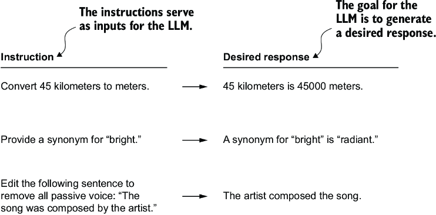

**Figure 7.2 Examples of instructions that are processed by an LLM to**

**generate desired responses**


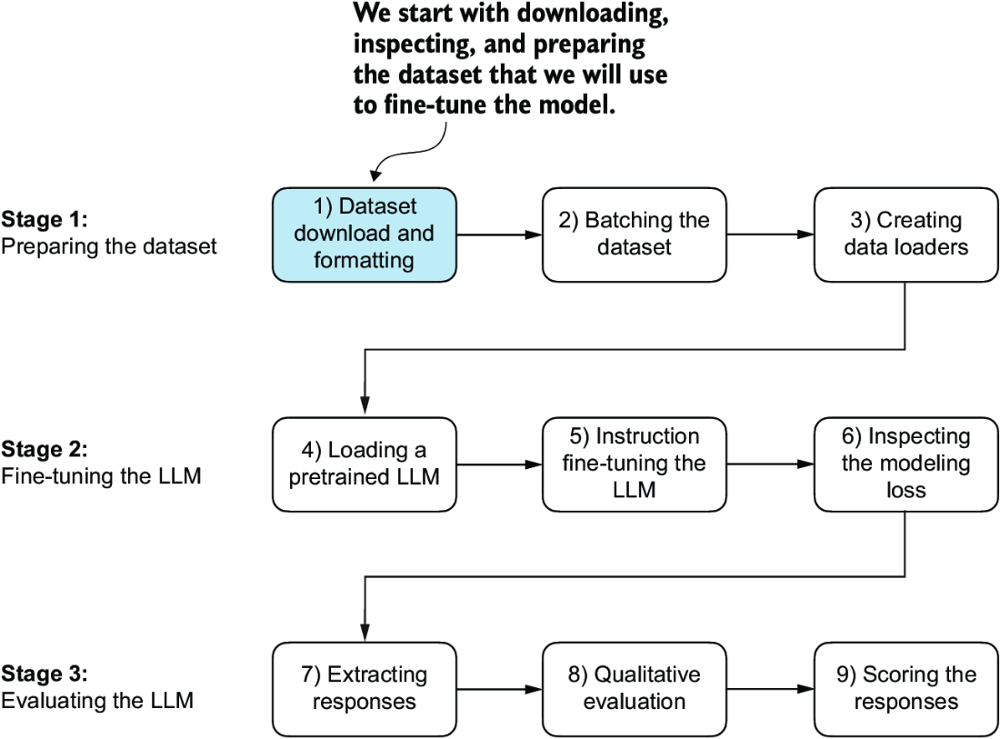

**Figure 7.3 The three-stage process for instruction fine-tuning an LLM.**

**Stage 1 involves dataset preparation, stage 2 focuses on model setup**


**and fine-tuning, and stage 3 covers the evaluation of the model. We will**

**begin with step 1 of stage 1: downloading and formatting the dataset.**

## 7.2 Preparing a dataset for supervised instruction fine-tuning

Let’s download and format the instruction dataset for
instruction fine-tuning a pretrained LLM. The dataset
consists of 1,100 instruction–response pairs similar to those
in figure 7.2. This dataset was created specifically for this
book, but interested readers can find alternative, publicly
available instruction datasets in appendix B.

The following code implements and executes a function to
download this dataset, which is a relatively small file (only
204 KB) in JSON format. JSON, or JavaScript Object
Notation, mirrors the structure of Python dictionaries,
providing a simple structure for data interchange that is both
human readable and machine friendly.

**Listing 7.1 Downloading the dataset**

```python
import json
import os
import urllib
def download_and_load_file(file_path, url):
if not os.path.exists(file_path):
with urllib.request.urlopen(url) as response:
text_data = response.read().decode("utf-8")
with open(file_path, "w", encoding="utf-8") as file:
file.write(text_data)
else:                                                #1
with open(file_path, "r", encoding="utf-8") as file:
text_data = file.read()
with open(file_path, "r") as file:
data = json.load(file)
return data
file_path = "instruction-data.json"
url = (
"https://raw.githubusercontent.com/rasbt/LLMs-from-scratch"
"/main/ch07/01_main-chapter-code/instruction-data.json"
)
data = download_and_load_file(file_path, url)
print("Number of entries:", len(data))
```

**#1 Skips download if file was already downloaded**

The output of executing the preceding code is
```python
Number of entries: 1100
```

The  list that we loaded from the JSON file contains the
`data`
1,100 entries of the instruction dataset. Let’s print one of
the entries to see how each entry is structured:
```python
print("Example entry:\n", data[50])
```

The content of the example entry is
```python
Example entry:
{'instruction': 'Identify the correct spelling of the following word.',
'input': 'Ocassion', 'output': "The correct spelling is 'Occasion.'"}
```

As we can see, the example entries are Python dictionary
objects containing an `'instruction'`, `'input'`, and `'output'`.
Let’s take a look at another example:

```python
print("Another example entry:\n", data[999])
```

Based on the contents of this entry, the `'input'` field may
occasionally be empty:
```python
Another example entry:
{'instruction': "What is an antonym of 'complicated'?",
'input': '',
'output': "An antonym of 'complicated' is 'simple'."}
```

Instruction fine-tuning involves training a model on a
dataset where the input-output pairs, like those we
extracted from the JSON file, are explicitly provided. There
are various methods to format these entries for LLMs. Figure
7.4 illustrates two different example formats, often referred
to as prompt styles, used in the training of notable LLMs
such as Alpaca and Phi-3.

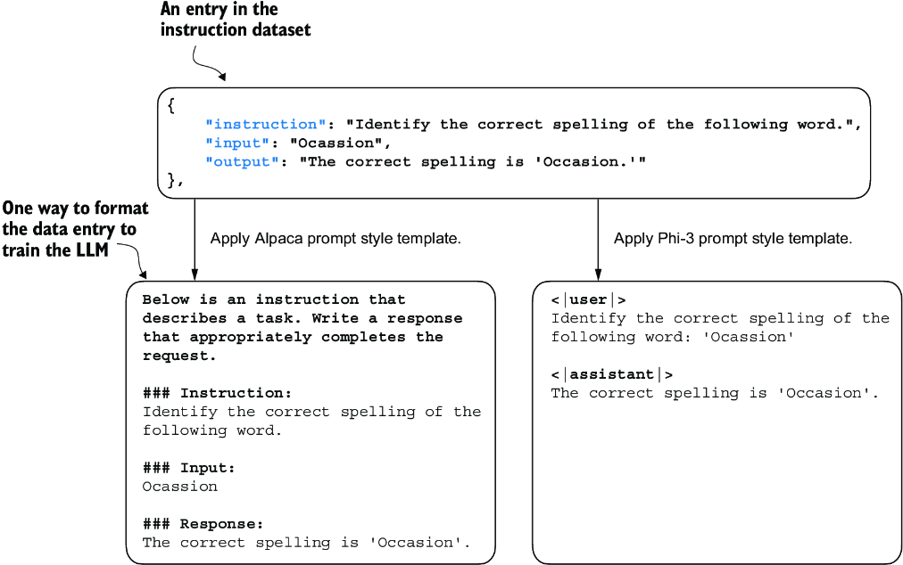

**Figure 7.4 Comparison of prompt styles for instruction fine-tuning in**

**LLMs. The Alpaca style (left) uses a structured format with defined**

**sections for instruction, input, and response, while the Phi-3 style**

**(right) employs a simpler format with designated**`<|user|>`**and**`<|assistant|>`

**tokens.**

Alpaca was one of the early LLMs to publicly detail its
instruction fine-tuning process. Phi-3, developed by
Microsoft, is included to demonstrate the diversity in prompt
styles. The rest of this chapter uses the Alpaca prompt style

since it is one of the most popular ones, largely because it
helped define the original approach to fine-tuning.

**EXERCISE 7.1 CHANGING PROMPT STYLES**

After fine-tuning the model with the Alpaca prompt style,
try the Phi-3 prompt style shown in figure 7.4 and observe
whether it affects the response quality of the model.

Let’s define a `format_input` function that we can use to
convert the entries in the  list into the Alpaca-style input
`data`
format.

**Listing 7.2 Implementing the prompt formatting function**

```python
def format_input(entry):
instruction_text = (
f"Below is an instruction that describes a task. "
f"Write a response that appropriately completes the request."
f"\n\\n### Instruction:\\n{entry['instruction']}"
)
input_text = (
f"\n\\n### Input:\\n{entry['input']}" if entry["input"] else ""
)
return instruction_text + input_text
```

This `format_input` function takes a dictionary `entry` as input
and constructs a formatted string. Let’s test it to dataset
entry , which we looked at earlier:
`data[50]`
```python
model_input = format_input(data[50])
desired_response = f"\n\\n### Response:\\n{data[50]['output']}"
print(model_input + desired_response)
```

The formatted input looks like as follows:

```python
Below is an instruction that describes a task. Write a response that
appropriately completes the request.
### Instruction:
Identify the correct spelling of the following word.
### Input:
Ocassion
### Response:
The correct spelling is 'Occasion.'
```

Note that the `format_input` skips the optional `###` `Input:`
section if the `'input'` field is empty, which we can test out by
applying the  function to entry  that we
`format_inputdata[999]`
inspected earlier:
```python
model_input = format_input(data[999])
desired_response = f"\n\\n### Response:\\n{data[999]['output']}"
print(model_input + desired_response)
```

The output shows that entries with an empty `'input'` field
don’t contain an `###` `Input:` section in the formatted input:
```python
Below is an instruction that describes a task. Write a response that
appropriately completes the request.
### Instruction:
What is an antonym of 'complicated'?
### Response:
An antonym of 'complicated' is 'simple'.
```

Before we move on to setting up the PyTorch data loaders in
the next section, let’s divide the dataset into training,
validation, and test sets analogous to what we have done
with the spam classification dataset in the previous chapter.
The following listing shows how we calculate the portions.

**Listing 7.3 Partitioning the dataset**

```python
train_portion = int(len(data) * 0.85)    #1
test_portion = int(len(data) * 0.1)            #2
val_portion = len(data) - train_portion - test_portion    #3
train_data = data[:train_portion]
test_data = data[train_portion:train_portion + test_portion]
val_data = data[train_portion + test_portion:]
print("Training set length:", len(train_data))
print("Validation set length:", len(val_data))
print("Test set length:", len(test_data))
```

**#1 Use 85% of the data for training**

**#2 Use 10% for testing**

**#3 Use remaining 5% for validation**

This partitioning results in the following dataset sizes:
```python
Training set length: 935
Validation set length: 55
Test set length: 110
```

Having successfully downloaded and partitioned the dataset
and gained a clear understanding of the dataset prompt
formatting, we are now ready for the core implementation of
the instruction fine-tuning process. Next, we focus on
developing the method for constructing the training batches
for fine-tuning the LLM.

## 7.3 Organizing data into training batches

As we progress into the implementation phase of our
instruction fine-tuning process, the next step, illustrated in
figure 7.5, focuses on constructing the training batches
effectively. This involves defining a method that will ensure
our model receives the formatted training data during the
fine-tuning process.

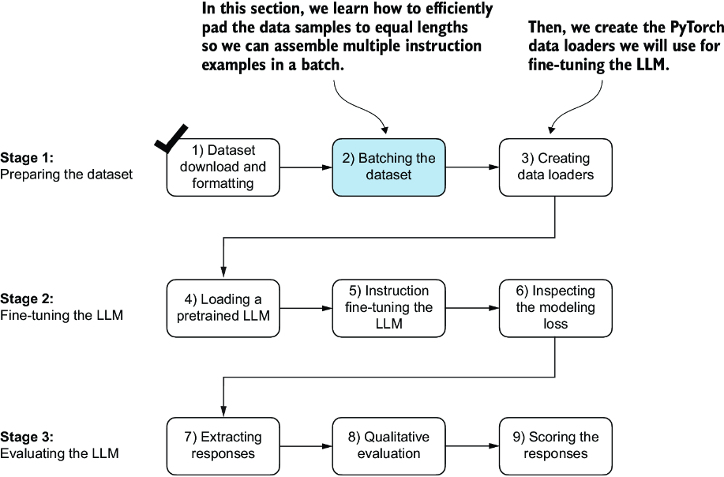

**Figure 7.5 The three-stage process for instruction fine-tuning an LLM.**

**Next, we look at step 2 of stage 1: assembling the training batches.**

In the previous chapter, the training batches were created
automatically by the PyTorch `DataLoader` class, which employs
a default collate function to combine lists of samples into
batches. A collate function is responsible for taking a list of
individual data samples and merging them into a single
batch that can be processed efficiently by the model during
training.

However, the batching process for instruction fine-tuning is a
bit more involved and requires us to create our own custom
collate function that we will later plug into the `DataLoader`. We
implement this custom collate function to handle the specific
requirements and formatting of our instruction fine-tuning
dataset.

Let’s tackle the batching process in several steps, including
coding the custom collate function, as illustrated in figure
7.6. First, to implement steps 2.1 and 2.2, we code an
class that applies  and
`InstructionDatasetformat_input`
pretokenizes all inputs in the dataset, similar to the
`SpamDataset` in chapter 6. This two-step process, detailed in
figure 7.7, is implemented in the  constructor
`__init__`
method of the `InstructionDataset`.

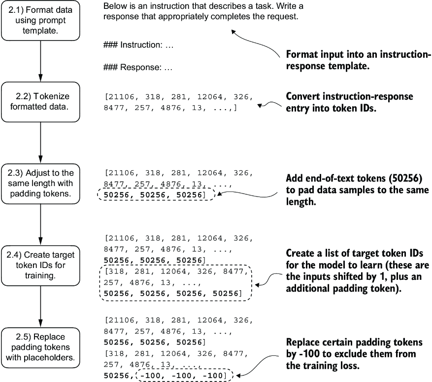

**Figure 7.6 The five substeps involved in implementing the batching**

**process: (2.1) applying the prompt template, (2.2) using tokenization**

**from previous chapters, (2.3) adding padding tokens, (2.4) creating**

**target token IDs, and (2.5) replacing**`-100`**placeholder tokens to mask**

**padding tokens in the loss function.**


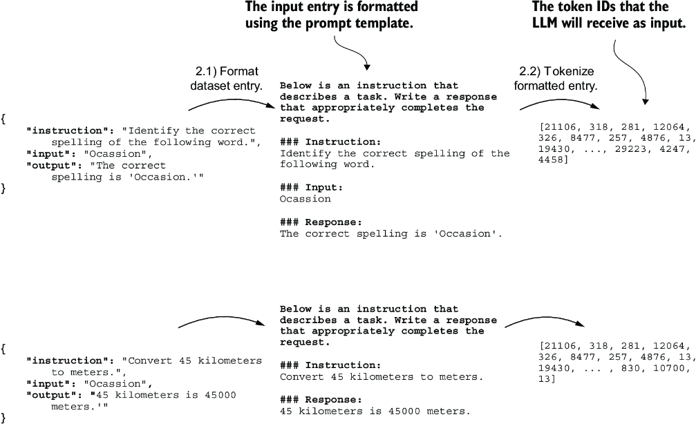

**Figure 7.7 The first two steps involved in implementing the batching**

**process. Entries are first formatted using a specific prompt template**

**(2.1) and then tokenized (2.2), resulting in a sequence of token IDs that**

**the model can process.**


**Listing 7.4 Implementing an instruction dataset class**

```python
import torch
from torch.utils.data import Dataset
class InstructionDataset(Dataset):
def __init__(self, data, tokenizer):
self.data = data
self.encoded_texts = []
for entry in data:         #1
instruction_plus_input = format_input(entry)
response_text = f"\n\\n### Response:\\n{entry['output']}"
full_text = instruction_plus_input + response_text
self.encoded_texts.append(
tokenizer.encode(full_text)
)
def __getitem__(self, index):
return self.encoded_texts[index]
def __len__(self):
return len(self.data)
```

**#1 Pretokenizes texts**

Similar to the approach used for classification fine-tuning,
we want to accelerate training by collecting multiple training
examples in a batch, which necessitates padding all inputs to
a similar length. As with classification fine-tuning, we use
the `<|endoftext|>` token as a padding token.

Instead of appending the `<|endoftext|>` tokens to the text
inputs, we can append the token ID corresponding to
to the pretokenized inputs directly. We can use
`<|endoftext|>`
the tokenizer’s `.encode` method on an `<|endoftext|>` token to
remind us which token ID we should use:
```python
import tiktoken
tokenizer = tiktoken.get_encoding("gpt2")
print(tokenizer.encode("<|endoftext|>", allowed_special={"<|endoftext|>"}))
```

The resulting token ID is .
`50256`
Moving on to step 2.3 of the process (see figure 7.6), we
adopt a more sophisticated approach by developing a
custom collate function that we can pass to the data loader.
This custom collate function pads the training examples in

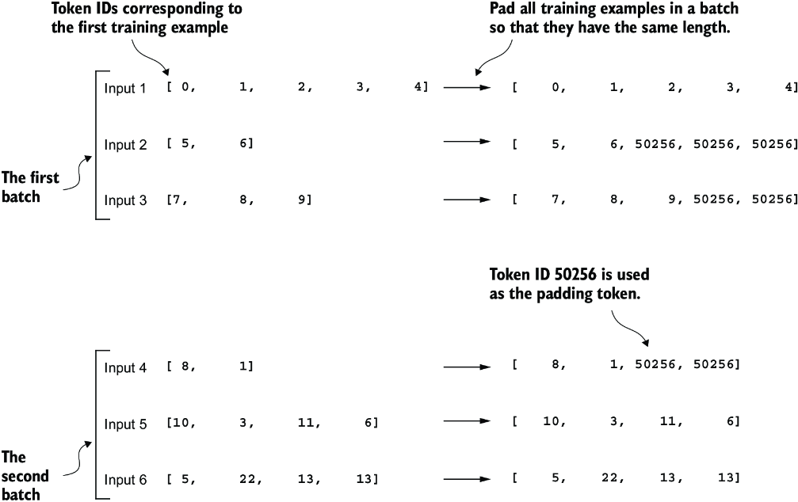

each batch to the same length while allowing different
batches to have different lengths, as demonstrated in figure
7.8. This approach minimizes unnecessary padding by only
extending sequences to match the longest one in each
batch, not the whole dataset.

**Figure 7.8 The padding of training examples in batches using token ID**

`50256`**to ensure uniform length within each batch. Each batch may have**

**different lengths, as shown by the first and second.**


We can implement the padding process with a custom collate
function:
```python
def custom_collate_draft_1(
batch,
pad_token_id=50256,
device="cpu"
):
batch_max_length = max(len(item)+1 for item in batch)   #1
inputs_lst = []
for item in batch:     #2
new_item = item.copy()
new_item += [pad_token_id]
padded = (
new_item + [pad_token_id] *
(batch_max_length - len(new_item))
)
inputs = torch.tensor(padded[:-1])    #3
inputs_lst.append(inputs)
inputs_tensor = torch.stack(inputs_lst).to(device)     #4
return inputs_tensor
```

**#1 Finds the longest sequence in the batch**

**#2 Pads and prepares inputs**

**#3 Removes extra padded token added earlier**

**#4 Converts the list of inputs to a tensor and transfers it to the target**

**device**

The `custom_collate_draft_1` we implemented is designed to be
integrated into a PyTorch , but it can also function
`DataLoader`
as a standalone tool. Here, we use it independently to test
and verify that it operates as intended. Let’s try it on three
different inputs that we want to assemble into a batch,
where each example gets padded to the same length:
```python
inputs_1 = [0, 1, 2, 3, 4]
inputs_2 = [5, 6]
inputs_3 = [7, 8, 9]
batch = (
inputs_1,
inputs_2,
inputs_3
)
print(custom_collate_draft_1(batch))
```

The resulting batch looks like the following:

```python
tensor([[    0,     1,     2,     3,     4],
[    5,     6, 50256, 50256, 50256],
[    7,     8,     9, 50256, 50256]])
```

This output shows all inputs have been padded to the length
of the longest input list, , containing five token IDs.
`inputs_1`

We have just implemented our first custom collate function
to create batches from lists of inputs. However, as we
previously learned, we also need to create batches with the
target token IDs corresponding to the batch of input IDs.
These target IDs, as shown in figure 7.9, are crucial because
they represent what we want the model to generate and
what we need during training to calculate the loss for the
weight updates. That is, we modify our custom collate
function to return the target token IDs in addition to the
input token IDs.

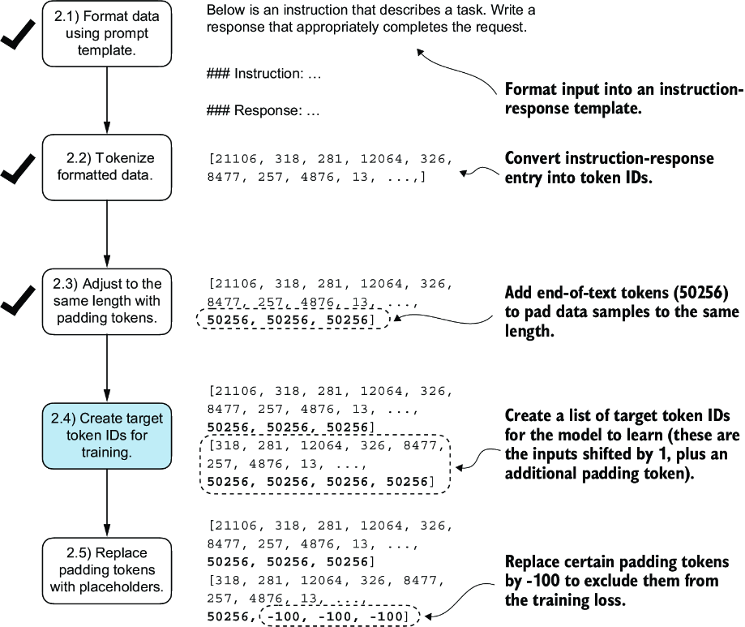

**Figure 7.9 The five substeps involved in implementing the batching**

**process. We are now focusing on step 2.4, the creation of target token**

**IDs. This step is essential as it enables the model to learn and predict**

**the tokens it needs to generate.**


Similar to the process we used to pretrain an LLM, the target
token IDs match the input token IDs but are shifted one
position to the right. This setup, as shown in figure 7.10,
allows the LLM to learn how to predict the next token in a
sequence.

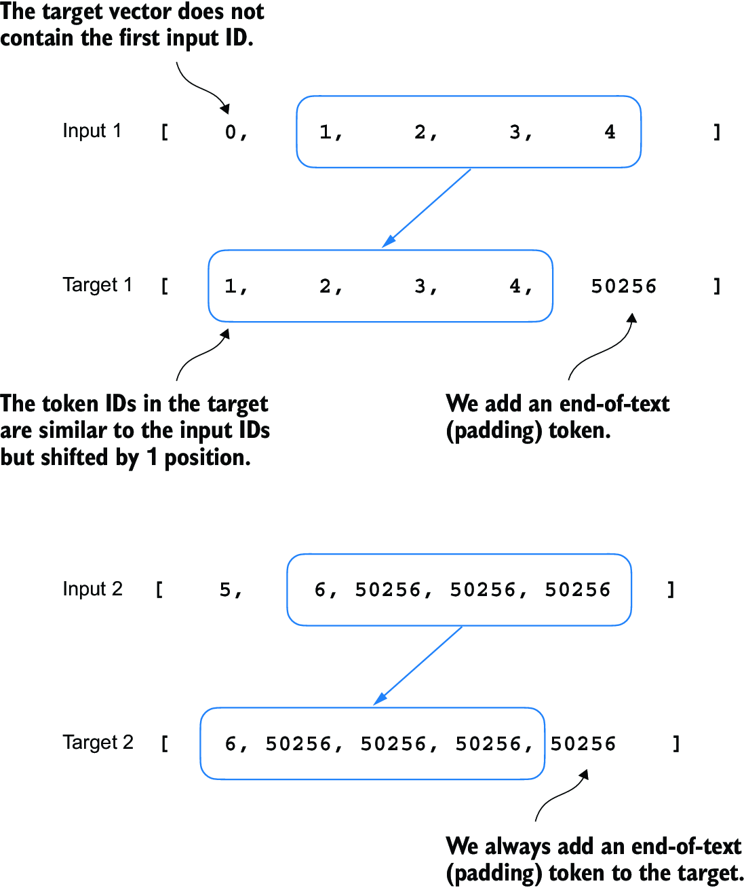


**Figure 7.10 The input and target token alignment used in the instruction**

**fine-tuning process of an LLM. For each input sequence, the**

**corresponding target sequence is created by shifting the token IDs one**

**position to the right, omitting the first token of the input, and appending**

**an end-of-text token.**

The following updated collate function generates the target
token IDs from the input token IDs:
```python
def custom_collate_draft_2(
batch,
pad_token_id=50256,
device="cpu"
):
batch_max_length = max(len(item)+1 for item in batch)
inputs_lst, targets_lst = [], []
for item in batch:
new_item = item.copy()
new_item += [pad_token_id]
padded = (
new_item + [pad_token_id] *
(batch_max_length - len(new_item))
)
inputs = torch.tensor(padded[:-1])     #1
targets = torch.tensor(padded[1:])    #2
inputs_lst.append(inputs)
targets_lst.append(targets)
inputs_tensor = torch.stack(inputs_lst).to(device)
targets_tensor = torch.stack(targets_lst).to(device)
return inputs_tensor, targets_tensor
inputs, targets = custom_collate_draft_2(batch)
print(inputs)
print(targets)
```

**#1 Truncates the last token for inputs**

**#2 Shifts +1 to the right for targets**

Applied to the example `batch` consisting of three input lists
we defined earlier, the new  function
`custom_collate_draft_2`
now returns the input and the target batch:
```python
tensor([[    0,     1,     2,     3,     4],    #1
[    5,     6, 50256, 50256, 50256],
[    7,     8,     9, 50256, 50256]])
tensor([[    1,     2,     3,     4, 50256],   #2
[    6, 50256, 50256, 50256, 50256],
[    8,     9, 50256, 50256, 50256]])
```

**#1 The first tensor represents inputs.**

**#2 The second tensor represents the targets.**


In the next step, we assign a  placeholder value to all
`-100`
padding tokens, as highlighted in figure 7.11. This special
value allows us to exclude these padding tokens from
contributing to the training loss calculation, ensuring that
only meaningful data influences model learning. We will
discuss this process in more detail after we implement this
modification. (When fine-tuning for classification, we did not
have to worry about this since we only trained the model
based on the last output token.)

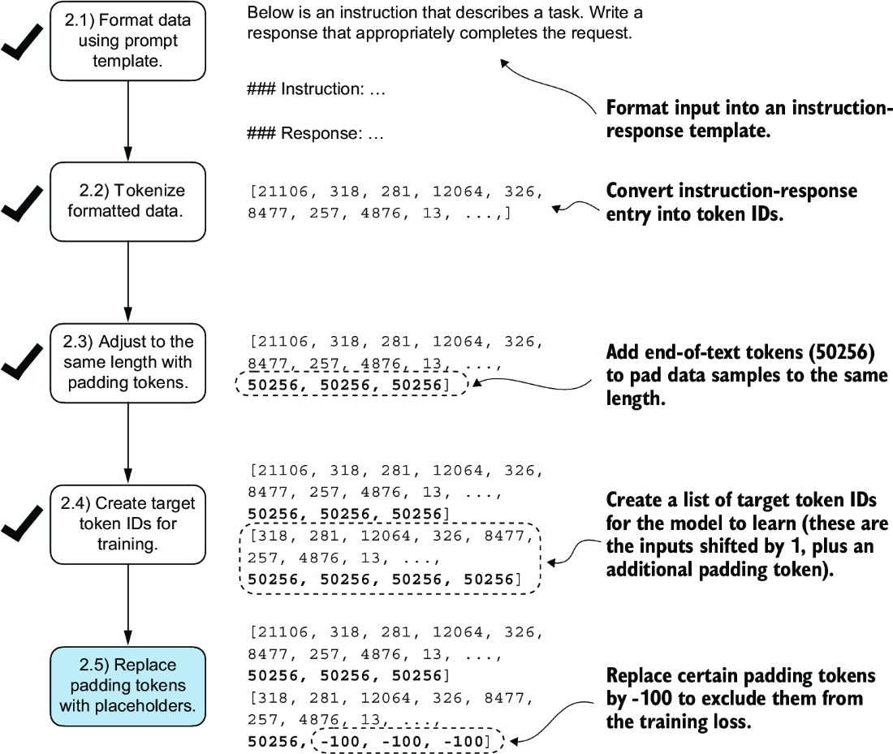


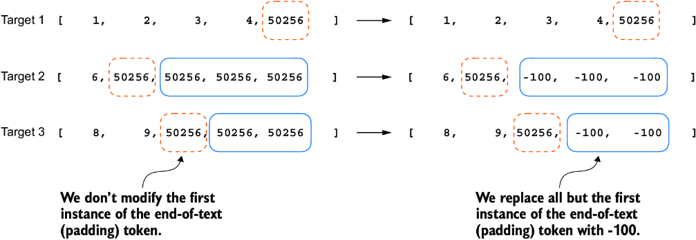

**Figure 7.11 The five substeps involved in implementing the batching**

**process. After creating the target sequence by shifting token IDs one**

**position to the right and appending an end-of-text token, in step 2.5, we**

**replace the end-of-text padding tokens with a placeholder value ().**

```python
-100
```

However, note that we retain one end-of-text token, ID
, in the target list, as depicted in figure 7.12. Retaining
`50256`
it allows the LLM to learn when to generate an end-of-text
token in response to instructions, which we use as an
indicator that the generated response is complete.

**Figure 7.12 Step 2.4 in the token replacement process in the target**

**batch for the training data preparation. We replace all but the first**

**instance of the end-of-text token, which we use as padding, with the**

**placeholder value , while keeping the initial end-of-text token in each**

```python
-100
```

**target sequence.**

In the following listing, we modify our custom collate
function to replace tokens with ID `50256` with `-100` in the
target lists. Additionally, we introduce an
`allowed_ max_length`
parameter to optionally limit the length of the samples. This
adjustment will be useful if you plan to work with your own

datasets that exceed the 1,024-token context size supported
by the GPT-2 model.

**Listing 7.5 Implementing a custom batch collate function**

```python
def custom_collate_fn(
batch,
pad_token_id=50256,
ignore_index=-100,
allowed_max_length=None,
device="cpu"
):
batch_max_length = max(len(item)+1 for item in batch)
inputs_lst, targets_lst = [], []
for item in batch:
new_item = item.copy()
new_item += [pad_token_id]
padded = (                               #1
new_item + [pad_token_id] *          #1
(batch_max_length - len(new_item))   #1
)
inputs = torch.tensor(padded[:-1])      #2
targets = torch.tensor(padded[1:])     #3
mask = targets == pad_token_id              #4
indices = torch.nonzero(mask).squeeze()     #4
if indices.numel() > 1:                     #4
targets[indices[1:]] = ignore_index     #4
if allowed_max_length is not None:
inputs = inputs[:allowed_max_length]       #5
targets = targets[:allowed_max_length]     #5
inputs_lst.append(inputs)
targets_lst.append(targets)
inputs_tensor = torch.stack(inputs_lst).to(device)
targets_tensor = torch.stack(targets_lst).to(device)
return inputs_tensor, targets_tensor
```

**#1 Pads sequences to max_length**

**#2 Truncates the last token for inputs**

**#3 Shifts +1 to the right for targets**

**#4 Replaces all but the first padding tokens in targets by ignore_index**

**#5 Optionally truncates to the maximum sequence length**

Again, let’s try the collate function on the sample batch that
we created earlier to check that it works as intended:
```python
inputs, targets = custom_collate_fn(batch)
print(inputs)
print(targets)
```


The results are as follows, where the first tensor represents
the inputs and the second tensor represents the targets:
```python
tensor([[    0,     1,     2,     3,     4],
[    5,     6, 50256, 50256, 50256],
[    7,     8,     9, 50256, 50256]])
tensor([[    1,     2,     3,     4, 50256],
[    6, 50256,  -100,  -100,  -100],
[    8,     9, 50256,  -100,  -100]])
```

The modified collate function works as expected, altering the
target list by inserting the token ID `-100`. What is the logic
behind this adjustment? Let’s explore the underlying
purpose of this modification.

For demonstration purposes, consider the following simple
and self-contained example where each output logit
corresponds to a potential token from the model’s
vocabulary. Here’s how we might calculate the cross entropy
loss (introduced in chapter 5) during training when the
model predicts a sequence of tokens, which is similar to
what we did when we pretrained the model and fine-tuned it
for classification:
```python
logits_1 = torch.tensor(
[[-1.0, 1.0],     #1
[-0.5, 1.5]]      #2
)
targets_1 = torch.tensor([0, 1]) # Correct token indices to generate
loss_1 = torch.nn.functional.cross_entropy(logits_1, targets_1)
print(loss_1)
```

**#1 predictions for 1st token**

**#2 predictions for 2nd token**

The loss value calculated by the previous code is `1.1269`:
```python
tensor(1.1269)
```

As we would expect, adding an additional token ID affects
the loss calculation:

```python
logits_2 = torch.tensor(
[[-1.0, 1.0],
[-0.5, 1.5],
[-0.5, 1.5]]      #1
)
targets_2 = torch.tensor([0, 1, 1])
loss_2 = torch.nn.functional.cross_entropy(logits_2, targets_2)
print(loss_2)
```

**#1 New third token ID prediction**

After adding the third token, the loss value is .
`0.7936`

So far, we have carried out some more or less obvious
example calculations using the cross entropy loss function in
PyTorch, the same loss function we used in the training
functions for pretraining and fine-tuning for classification.
Now let’s get to the interesting part and see what happens if
we replace the third target token ID with `-100`:
```python
targets_3 = torch.tensor([0, 1, -100])
loss_3 = torch.nn.functional.cross_entropy(logits_2, targets_3)
print(loss_3)
print("loss_1 == loss_3:", loss_1 == loss_3)
```

The resulting output is
```python
tensor(1.1269)
loss_1 == loss_3: tensor(True)
```

The resulting loss on these three training examples is
identical to the loss we calculated from the two training
examples earlier. In other words, the cross entropy loss
function ignored the third entry in the `targets_3` vector, the
token ID corresponding to . (Interested readers can try
`-100`
to replace the `-100` value with another token ID that is not `0`
or `1`; it will result in an error.)

So what’s so special about `-100` that it’s ignored by the cross
entropy loss? The default setting of the cross entropy
function in PyTorch is `cross_entropy(...,` `ignore_index=-100)`.
This means that it ignores targets labeled with `-100`. We take
advantage of this  to ignore the additional end-
`ignore_index`

of-text (padding) tokens that we used to pad the training
examples to have the same length in each batch. However,
we want to keep one `50256` (end-of-text) token ID in the
targets because it helps the LLM to learn to generate end-of-
text tokens, which we can use as an indicator that a
response is complete.

In addition to masking out padding tokens, it is also
common to mask out the target token IDs that correspond
to the instruction, as illustrated in figure 7.13. By masking
out the LLM’s target token IDs corresponding to the
instruction, the cross entropy loss is only computed for the
generated response target IDs. Thus, the model is trained to
focus on generating accurate responses rather than
memorizing instructions, which can help reduce overfitting.

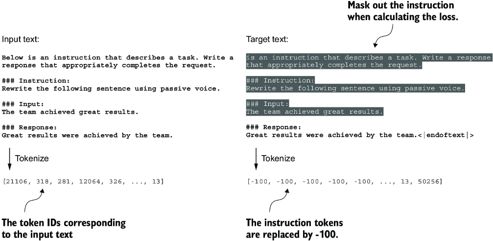

**Figure 7.13 Left: The formatted input text we tokenize and then feed to**

**the LLM during training. Right: The target text we prepare for the LLM**

**where we can optionally mask out the instruction section, which means**

**replacing the corresponding token IDs with the**`-100` `ignore_index`**value.**

As of this writing, researchers are divided on whether
masking the instructions is universally beneficial during
instruction fine-tuning. For instance, the 2024 paper by Shi
et al., “Instruction Tuning With Loss Over Instructions”
(https://arxiv.org/abs/2405.14394), demonstrated that not
masking the instructions benefits the LLM performance (see
appendix B for more details). Here, we will not apply
masking and leave it as an optional exercise for interested
readers.

**EXERCISE 7.2 INSTRUCTION AND INPUT MASKING**

After completing the chapter and fine-tuning the model
with `InstructionDataset`, replace the instruction and input
tokens with the  mask to use the instruction masking
`-100`
method illustrated in figure 7.13. Then evaluate whether
this has a positive effect on model performance.

## 7.4 Creating data loaders for an instruction dataset

We have completed several stages to implement an
`InstructionDataset` class and a `custom_collate_fn` function for
the instruction dataset. As shown in figure 7.14, we are
ready to reap the fruits of our labor by simply plugging both
objects and the  function
`InstructionDatasetcustom_collate_fn`
into PyTorch data loaders. These loaders will automatically
shuffle and organize the batches for the LLM instruction fine-
tuning process.

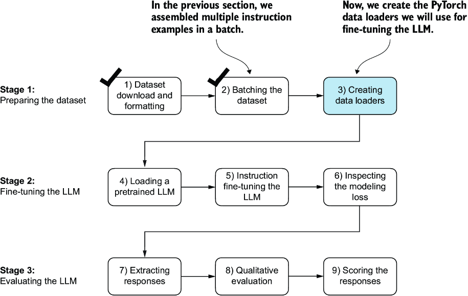

**Figure 7.14 The three-stage process for instruction fine-tuning an LLM.**

**Thus far, we have prepared the dataset and implemented a custom**

**collate function to batch the instruction dataset. Now, we can create and**

**apply the data loaders to the training, validation, and test sets needed**

**for the LLM instruction fine-tuning and evaluation.**

Before we implement the data loader creation step, we have
to briefly talk about the  setting of the
`device`
`custom_collate_fn`. The `custom_collate_fn` includes code to move
the input and target tensors (for example,
) to a specified device,
`torch.stack(inputs_lst).to (device)`
which can be either  or  (for NVIDIA GPUs) or,
`"cpu""cuda"`
optionally, `"mps"` for Macs with Apple Silicon chips.

Note  Using an  device may result in numerical
`"mps"`
differences compared to the contents of this chapter, as
Apple Silicon support in PyTorch is still experimental.

Previously, we moved the data onto the target device (for
example, the GPU memory when ) in the main
`device="cuda"`
training loop. Having this as part of the collate function
offers the advantage of performing this device transfer
process as a background process outside the training loop,
preventing it from blocking the GPU during model training.

The following code initializes the  variable:
`device`
```python
device = torch.device("cuda" if torch.cuda.is_available() else "cpu")
# if torch.backends.mps.is_available():   #1 device = torch.device("mps")"
print("Device:", device)
```

**#1 Uncomments these two lines to use the GPU on an Apple Silicon chip**

This will either print `"Device:` `cpu"` or `"Device:` `cuda"`, depending
on your machine.

Next, to reuse the chosen device setting in
`custom_collate_fn`
when we plug it into the PyTorch  class, we use the
`DataLoader`
`partial` function from Python’s `functools` standard library to
create a new version of the function with the device
argument prefilled. Additionally, we set the
`allowed_max_length`
to `1024`, which truncates the data to the maximum context
length supported by the GPT-2 model, which we will fine-
tune later:
```python
from functools import partial
customized_collate_fn = partial(
custom_collate_fn,
device=device,
allowed_max_length=1024
)
```

Next, we can set up the data loaders as we did previously,
but this time, we will use our custom collate function for the

batching process.

**Listing 7.6 Initializing the data loaders**

```python
from torch.utils.data import DataLoader
num_workers = 0      #1
batch_size = 8
torch.manual_seed(123)
train_dataset = InstructionDataset(train_data, tokenizer)
train_loader = DataLoader(
train_dataset,
batch_size=batch_size,
collate_fn=customized_collate_fn,
shuffle=True,
drop_last=True,
num_workers=num_workers
)
val_dataset = InstructionDataset(val_data, tokenizer)
val_loader = DataLoader(
val_dataset,
batch_size=batch_size,
collate_fn=customized_collate_fn,
shuffle=False,
drop_last=False,
num_workers=num_workers
)
test_dataset = InstructionDataset(test_data, tokenizer)
test_loader = DataLoader(
test_dataset,
batch_size=batch_size,
collate_fn=customized_collate_fn,
shuffle=False,
drop_last=False,
num_workers=num_workers
)
```

**#1 You can try to increase this number if parallel Python processes are**

**supported by your operating system.**

Let’s examine the dimensions of the input and target
batches generated by the training loader:
```python
print("Train loader:")
for inputs, targets in train_loader:
print(inputs.shape, targets.shape)
```

The output is as follows (truncated to conserve space):

```python
Train loader:
torch.Size([8, 61]) torch.Size([8, 61])
torch.Size([8, 76]) torch.Size([8, 76])
torch.Size([8, 73]) torch.Size([8, 73])
...
torch.Size([8, 74]) torch.Size([8, 74])
torch.Size([8, 69]) torch.Size([8, 69])
```

This output shows that the first input and target batch have
dimensions 8 × 61, where 8 represents the batch size and
61 is the number of tokens in each training example in this
batch. The second input and target batch have a different
number of tokens—for instance, 76. Thanks to our custom
collate function, the data loader is able to create batches of
different lengths. In the next section, we load a pretrained
LLM that we can then fine-tune with this data loader.

## 7.5 Loading a pretrained LLM

We have spent a lot of time preparing the dataset for
instruction fine-tuning, which is a key aspect of the
supervised fine-tuning process. Many other aspects are the
same as in pretraining, allowing us to reuse much of the
code from earlier chapters.

Before beginning instruction fine-tuning, we must first load a
pretrained GPT model that we want to fine-tune (see figure
7.15), a process we have undertaken previously. However,
instead of using the smallest 124-million-parameter model
as before, we load the medium-sized model with 355 million
parameters. The reason for this choice is that the 124-
million-parameter model is too limited in capacity to achieve
satisfactory results via instruction fine-tuning. Specifically,
smaller models lack the necessary capacity to learn and
retain the intricate patterns and nuanced behaviors required
for high-quality instruction-following tasks.

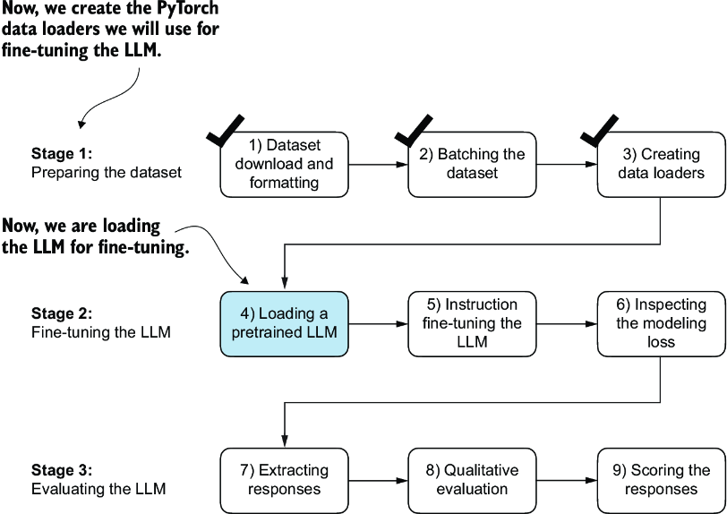

**Figure 7.15 The three-stage process for instruction fine-tuning an LLM.**

**After the dataset preparation, the process of fine-tuning an LLM for**

**instruction-following begins with loading a pretrained LLM, which serves**

**as the foundation for subsequent training.**

Loading our pretrained models requires the same code as
when we pretrained the data (section 5.5) and fine-tuned it
for classification (section 6.4), except that we now specify
`"gpt2-medium` `(355M)"` instead of `"gpt2-small` `(124M)"`.

Note  Executing this code will initiate the download of
the medium-sized GPT model, which has a storage
requirement of approximately 1.42 gigabytes. This is

roughly three times larger than the storage space
needed for the small model.

**Listing 7.7 Loading the pretrained model**

```python
from gpt_download import download_and_load_gpt2
from chapter04 import GPTModel
from chapter05 import load_weights_into_gpt
BASE_CONFIG = {
"vocab_size": 50257,     # Vocabulary size
"context_length": 1024,  # Context length
"drop_rate": 0.0,        # Dropout rate
"qkv_bias": True         # Query-key-value bias
}
model_configs = {
"gpt2-small (124M)": {"emb_dim": 768, "n_layers": 12, "n_heads": 12},
"gpt2-medium (355M)": {"emb_dim": 1024, "n_layers": 24, "n_heads": 16},
"gpt2-large (774M)": {"emb_dim": 1280, "n_layers": 36, "n_heads": 20},
"gpt2-xl (1558M)": {"emb_dim": 1600, "n_layers": 48, "n_heads": 25},
}
CHOOSE_MODEL = "gpt2-medium (355M)"
BASE_CONFIG.update(model_configs[CHOOSE_MODEL])
model_size = CHOOSE_MODEL.split(" ")[-1].lstrip("(").rstrip(")")
settings, params = download_and_load_gpt2(
model_size=model_size,
models_dir="gpt2"
)
model = GPTModel(BASE_CONFIG)
load_weights_into_gpt(model, params)
model.eval();
```

After executing the code, several files will be downloaded:
```python
checkpoint: 100%|██████████| 77.0/77.0 [00:00<00:00, 156kiB/s]
encoder.json: 100%|██████████| 1.04M/1.04M [00:02<00:00, 467kiB/s]
hparams.json: 100%|██████████| 91.0/91.0 [00:00<00:00, 198kiB/s]
model.ckpt.data-00000-of-00001: 100%|██████████| 1.42G/1.42G
[05:50<00:00, 4.05MiB/s]
model.ckpt.index: 100%|██████████| 10.4k/10.4k [00:00<00:00, 18.1MiB/s]
model.ckpt.meta: 100%|██████████| 927k/927k [00:02<00:00, 454kiB/s]
vocab.bpe: 100%|██████████| 456k/456k [00:01<00:00, 283kiB/s]
```

Now, let’s take a moment to assess the pretrained LLM’s
performance on one of the validation tasks by comparing its
output to the expected response. This will give us a baseline
understanding of how well the model performs on an
instruction-following task right out of the box, prior to fine-

tuning, and will help us appreciate the effect of fine-tuning
later on. We will use the first example from the validation set
for this assessment:
```python
torch.manual_seed(123)
input_text = format_input(val_data[0])
print(input_text)
```

The content of the instruction is as follows:
```python
Below is an instruction that describes a task. Write a response that
appropriately completes the request.
### Instruction:
Convert the active sentence to passive: 'The chef cooks the meal every day.'
```

Next we generate the model’s response using the same
`generate` function we used to pretrain the model in chapter 5:
```python
from chapter05 import generate, text_to_token_ids, token_ids_to_text
token_ids = generate(
model=model,
idx=text_to_token_ids(input_text, tokenizer),
max_new_tokens=35,
context_size=BASE_CONFIG["context_length"],
eos_id=50256,
)
generated_text = token_ids_to_text(token_ids, tokenizer)
```

The  function returns the combined input and output
`generate`
text. This behavior was previously convenient since
pretrained LLMs are primarily designed as text-completion
models, where the input and output are concatenated to
create coherent and legible text. However, when evaluating
the model’s performance on a specific task, we often want to
focus solely on the model’s generated response.

To isolate the model’s response text, we need to subtract the
length of the input instruction from the start of the
:
`generated_text`
```python
response_text = generated_text[len(input_text):].strip()
print(response_text)
```


This code removes the input text from the beginning of the
`generated_text`, leaving us with only the model’s generated
response. The `strip()` function is then applied to remove any
leading or trailing whitespace characters. The output is
```python
### Response:
The chef cooks the meal every day.
### Instruction:
Convert the active sentence to passive: 'The chef cooks the
```

This output shows that the pretrained model is not yet
capable of correctly following the given instruction. While it
does create a Response section, it simply repeats the
original input sentence and part of the instruction, failing to
convert the active sentence to passive voice as requested.
So, let’s now implement the fine-tuning process to improve
the model’s ability to comprehend and appropriately respond
to such requests.

## 7.6 Fine-tuning the LLM on instruction data

It’s time to fine-tune the LLM for instructions (figure 7.16).
We will take the loaded pretrained model in the previous
section and further train it using the previously prepared
instruction dataset prepared earlier in this chapter. We
already did all the hard work when we implemented the
instruction dataset processing at the beginning of this
chapter. For the fine-tuning process itself, we can reuse the
loss calculation and training functions implemented in
chapter 5:

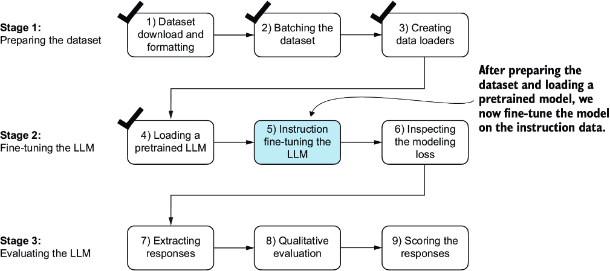

**Figure 7.16 The three-stage process for instruction fine-tuning an LLM.**

**In step 5, we train the pretrained model we previously loaded on the**

**instruction dataset we prepared earlier.**

```python
from chapter05 import (
calc_loss_loader,
train_model_simple
)
```

Before we begin training, let’s calculate the initial loss for the
training and validation sets:
```python
model.to(device)
torch.manual_seed(123)
with torch.no_grad():
train_loss = calc_loss_loader(
train_loader, model, device, num_batches=5
)
val_loss = calc_loss_loader(
val_loader, model, device, num_batches=5
)
print("Training loss:", train_loss)
print("Validation loss:", val_loss)
```


The initial loss values are as follows; as previously, our goal
is to minimize the loss:
```python
Training loss: 3.825908660888672
Validation loss: 3.7619335651397705
```


**DEALING WITH HARDWARE LIMITATIONS**

Using and training a larger model like GPT-2 medium (355
million parameters) is more computationally intensive than
the smaller GPT-2 model (124 million parameters). If you
encounter problems due to hardware limitations, you can
switch to the smaller model by changing
`CHOOSE_MODEL=`
`"gpt2-medium` `(355M)"` to `CHOOSE_MODEL` `=` `"gpt2-small` `(124M)"` (see
section 7.5). Alternatively, to speed up the model training,
consider using a GPU. The following supplementary section
in this book’s code repository lists several options for using
cloud GPUs: https://mng.bz/EOEq.

The following table provides reference run times for
training each model on various devices, including CPUs
and GPUs, for GPT-2. Running this code on a compatible
GPU requires no code changes and can significantly speed
up training. For the results shown in this chapter, I used
the GPT-2 medium model and trained it on an A100 GPU.

Run time for two
Model nameDevice
epochs
gpt2-mediumCPU (M3 MacBook
15.78 minutes
(355M)Air)
gpt2-medium
GPU (NVIDIA L4)1.83 minutes
(355M)
gpt2-mediumGPU (NVIDIA
0.86 minutes
(355M)A100)
gpt2-smallCPU (M3 MacBook
5.74 minutes
(124M)Air)
gpt2-small
GPU (NVIDIA L4)0.69 minutes
(124M)
gpt2-smallGPU (NVIDIA
0.39 minutes
(124M)A100)

With the model and data loaders prepared, we can now
proceed to train the model. The code in listing 7.8 sets up
the training process, including initializing the optimizer,
setting the number of epochs, and defining the evaluation
frequency and starting context to evaluate generated LLM
responses during training based on the first validation set
instruction (`val_data[0]`) we looked at in section 7.5.

**Listing 7.8 Instruction fine-tuning the pretrained LLM**

```python
import time
start_time = time.time()
torch.manual_seed(123)
optimizer = torch.optim.AdamW(
model.parameters(), lr=0.00005, weight_decay=0.1
)
num_epochs = 2
train_losses, val_losses, tokens_seen = train_model_simple(
model, train_loader, val_loader, optimizer, device,
num_epochs=num_epochs, eval_freq=5, eval_iter=5,
start_context=format_input(val_data[0]), tokenizer=tokenizer
)
end_time = time.time()
execution_time_minutes = (end_time - start_time) / 60
print(f"Training completed in {execution_time_minutes:.2f} minutes.")
```

The following output displays the training progress over two
epochs, where a steady decrease in losses indicates
improving ability to follow instructions and generate
appropriate responses:

```python
Ep 1 (Step 000000): Train loss 2.637, Val loss 2.626
Ep 1 (Step 000005): Train loss 1.174, Val loss 1.103
Ep 1 (Step 000010): Train loss 0.872, Val loss 0.944
Ep 1 (Step 000015): Train loss 0.857, Val loss 0.906
...
Ep 1 (Step 000115): Train loss 0.520, Val loss 0.665
Below is an instruction that describes a task. Write a response that
appropriately completes the request.  ### Instruction: Convert the
active sentence to passive: 'The chef cooks the meal every day.'
### Response: The meal is prepared every day by the chef.<|endoftext|>
The following is an instruction that describes a task.
Write a response that appropriately completes the request.
### Instruction: Convert the active sentence to passive:
Ep 2 (Step 000120): Train loss 0.438, Val loss 0.670
Ep 2 (Step 000125): Train loss 0.453, Val loss 0.685
Ep 2 (Step 000130): Train loss 0.448, Val loss 0.681
Ep 2 (Step 000135): Train loss 0.408, Val loss 0.677
...
Ep 2 (Step 000230): Train loss 0.300, Val loss 0.657
Below is an instruction that describes a task. Write a response
that appropriately completes the request.  ### Instruction:
Convert the active sentence to passive: 'The chef cooks the meal
every day.'  ### Response: The meal is cooked every day by the
chef.<|endoftext|>The following is an instruction that describes
a task. Write a response that appropriately completes the request.
### Instruction: What is the capital of the United Kingdom
Training completed in 0.87 minutes.
```

The training output shows that the model is learning
effectively, as we can tell based on the consistently
decreasing training and validation loss values over the two
epochs. This result suggests that the model is gradually
improving its ability to understand and follow the provided
instructions. (Since the model demonstrated effective
learning within these two epochs, extending the training to a
third epoch or more is not essential and may even be
counterproductive as it could lead to increased overfitting.)

Moreover, the generated responses at the end of each epoch
let us inspect the model’s progress in correctly executing the
given task in the validation set example. In this case, the
model successfully converts the active sentence `"The` `chef`
into its passive voice counterpart:
`cooksthemealeveryday."`
`"Themealiscookedeverydaybythechef."`

We will revisit and evaluate the response quality of the
model in more detail later. For now, let’s examine the
training and validation loss curves to gain additional insights

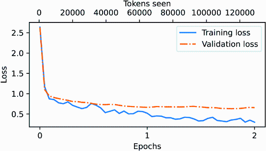

into the model’s learning process. For this, we use the same
`plot_losses` function we used for pretraining:
```python
from chapter05 import plot_losses
epochs_tensor = torch.linspace(0, num_epochs, len(train_losses))
plot_losses(epochs_tensor, tokens_seen, train_losses, val_losses)
```

From the loss plot shown in figure 7.17, we can see that the
model’s performance on both the training and validation sets
improves substantially over the course of training. The rapid
decrease in losses during the initial phase indicates that the
model quickly learns meaningful patterns and
representations from the data. Then, as training progresses
to the second epoch, the losses continue to decrease but at
a slower rate, suggesting that the model is fine-tuning its
learned representations and converging to a stable solution.

**Figure 7.17 The training and validation loss trends over two epochs. The**

**solid line represents the training loss, showing a sharp decrease before**

**stabilizing, while the dotted line represents the validation loss, which**

**follows a similar pattern.**

While the loss plot in figure 7.17 indicates that the model is
training effectively, the most crucial aspect is its
performance in terms of response quality and correctness.

So, next, let’s extract the responses and store them in a
format that allows us to evaluate and quantify the response
quality.

**EXERCISE 7.3 FINE-TUNING ON THE ORIGINAL ALPACA DATASET**

The Alpaca dataset, by researchers at Stanford, is one of
the earliest and most popular openly shared instruction
datasets, consisting of 52,002 entries. As an alternative to
the  file we use here, consider fine-
`instruction-data.json`
tuning an LLM on this dataset. The dataset is available at
https://mng.bz/NBnE.

This dataset contains 52,002 entries, which is
approximately 50 times more than those we used here,
and most entries are longer. Thus, I highly recommend
using a GPU to conduct the training, which will accelerate
the fine-tuning process. If you encounter out-of-memory
errors, consider reducing the  from 8 to 4, 2, or
`batch_size`
even 1. Lowering the  from 1,024 to 512
`allowed_max_length`
or 256 can also help manage memory problems.

## 7.7 Extracting and saving responses

Having fine-tuned the LLM on the training portion of the
instruction dataset, we are now ready to evaluate its
performance on the held-out test set. First, we extract the
model-generated responses for each input in the test
dataset and collect them for manual analysis, and then we
evaluate the LLM to quantify the quality of the responses, as
highlighted in figure 7.18.

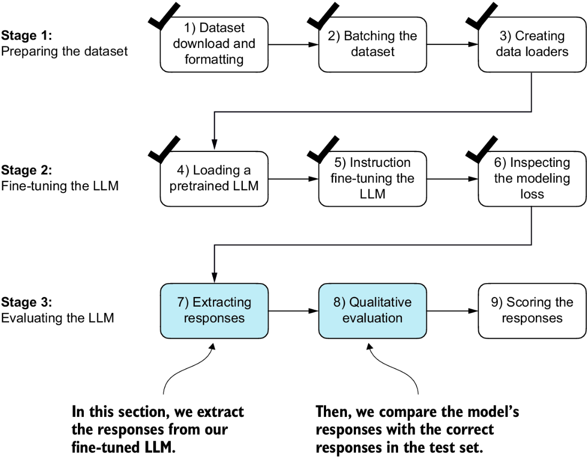


**Figure 7.18 The three-stage process for instruction fine-tuning the LLM.**

**In the first two steps of stage 3, we extract and collect the model**

**responses on the held-out test dataset for further analysis and then**

**evaluate the model to quantify the performance of the instruction-fine-**

**tuned LLM.**

To complete the response instruction step, we use the
`generate` function. We then print the model responses
alongside the expected test set answers for the first three
test set entries, presenting them side by side for
comparison:
```python
torch.manual_seed(123)
for entry in test_data[:3]:      #1
input_text = format_input(entry)
token_ids = generate(               #2
model=model,
idx=text_to_token_ids(input_text, tokenizer).to(device),
max_new_tokens=256,
context_size=BASE_CONFIG["context_length"],
eos_id=50256
)
generated_text = token_ids_to_text(token_ids, tokenizer)
response_text = (
generated_text[len(input_text):]
.replace("### Response:", "")
.strip()
)
print(input_text)
print(f"\nCorrect response:\\n>> {entry['output']}")
print(f"\nModel response:\\n>> {response_text.strip()}")
print("-------------------------------------")
```

**#1 Iterates over the first three test set samples**

**#2 Uses the generate function imported in section 7.5**

As mentioned earlier, the `generate` function returns the
combined input and output text, so we use slicing and the
method on the  contents to extract
`.replace()generated_text`
the model’s response. The instructions, followed by the
given test set response and model response, are shown
next.

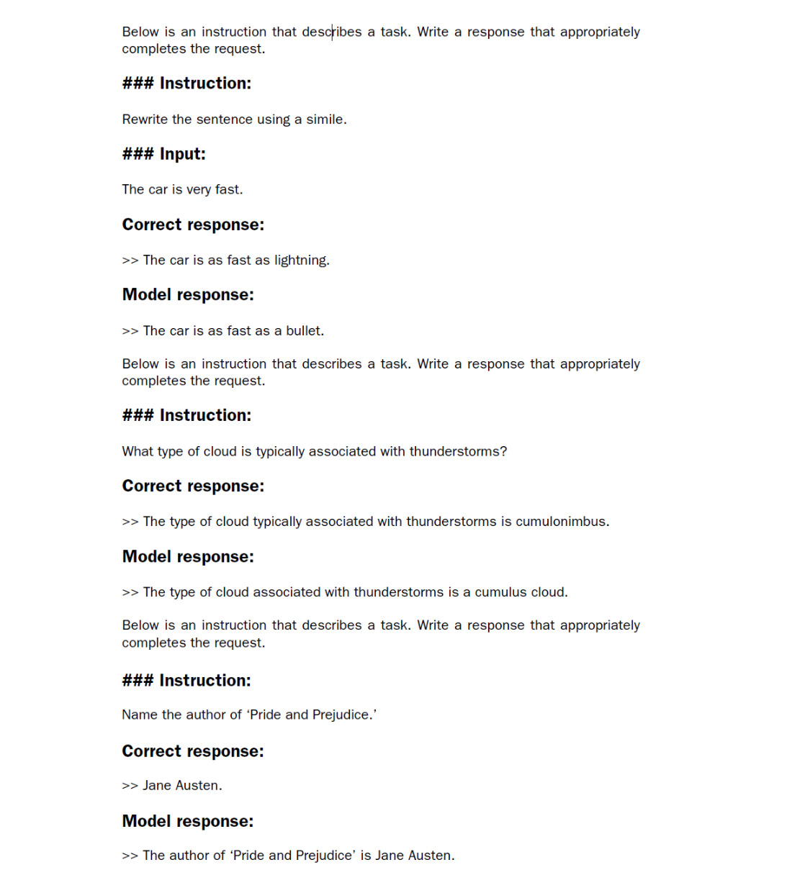


As we can see based on the test set instructions, given
responses, and the model’s responses, the model performs
relatively well. The answers to the first and last instructions
are clearly correct, while the second answer is close but not
entirely accurate. The model answers with “cumulus cloud”
instead of “cumulonimbus,” although it’s worth noting that
cumulus clouds can develop into cumulonimbus clouds,
which are capable of producing thunderstorms.

Most importantly, model evaluation is not as straightforward
as it is for completion fine-tuning, where we simply calculate
the percentage of correct spam/non-spam class labels to
obtain the classification’s accuracy. In practice, instruction-
fine-tuned LLMs such as chatbots are evaluated via multiple
approaches:

Short-answer and multiple-choice benchmarks, such as Measuring
Massive Multitask Language Understanding (MMLU;
https://arxiv.org/abs/2009.03300), which test the general knowledge of
a model.
Human preference comparison to other LLMs, such as LMSYS chatbot
arena (https://arena.lmsys.org).
Automated conversational benchmarks, where another LLM like GPT-4
is used to evaluate the responses, such as AlpacaEval (https://tatsu-
lab.github.io/alpaca_eval/).

In practice, it can be useful to consider all three types of
evaluation methods: multiple-choice question answering,
human evaluation, and automated metrics that measure
conversational performance. However, since we are primarily
interested in assessing conversational performance rather
than just the ability to answer multiple-choice questions,
human evaluation and automated metrics may be more
relevant.

**CONVERSATIONAL PERFORMANCE**

Conversational performance of LLMs refers to their ability
to engage in human-like communication by understanding
context, nuance, and intent. It encompasses skills such as
providing relevant and coherent responses, maintaining
consistency, and adapting to different topics and styles of
interaction.

Human evaluation, while providing valuable insights, can be
relatively laborious and time-consuming, especially when
dealing with a large number of responses. For instance,
reading and assigning ratings to all 1,100 responses would
require a significant amount of effort.

So, considering the scale of the task at hand, we will
implement an approach similar to automated conversational
benchmarks, which involves evaluating the responses
automatically using another LLM. This method will allow us
to efficiently assess the quality of the generated responses
without the need for extensive human involvement, thereby
saving time and resources while still obtaining meaningful
performance indicators.

Let’s employ an approach inspired by AlpacaEval, using
another LLM to evaluate our fine-tuned model’s responses.
However, instead of relying on a publicly available
benchmark dataset, we use our own custom test set. This
customization allows for a more targeted and relevant
assessment of the model’s performance within the context of
our intended use cases, represented in our instruction
dataset.

To prepare the responses for this evaluation process, we
append the generated model responses to the
`test_set`

dictionary and save the updated data as an
`"instruction-data-`
`with-response.json"` file for record keeping. Additionally, by
saving this file, we can easily load and analyze the
responses in separate Python sessions later on if needed.

The following code listing uses the  method in the
`generate`
same manner as before; however, we now iterate over the
entire `test_set`. Also, instead of printing the model
responses, we add them to the  dictionary.
`test_set`

**Listing 7.9 Generating test set responses**

```python
from tqdm import tqdm
for i, entry in tqdm(enumerate(test_data), total=len(test_data)):
input_text = format_input(entry)
token_ids = generate(
model=model,
idx=text_to_token_ids(input_text, tokenizer).to(device),
max_new_tokens=256,
context_size=BASE_CONFIG["context_length"],
eos_id=50256
)
generated_text = token_ids_to_text(token_ids, tokenizer)
response_text = (
generated_text[len(input_text):]
.replace("### Response:", "")
.strip()
)
test_data[i]["model_response"] = response_text
with open("instruction-data-with-response.json", "w") as file:
json.dump(test_data, file, indent=4)         #1
```

**#1 indent for pretty-printing**

Processing the dataset takes about 1 minute on an A100
GPU and 6 minutes on an M3 MacBook Air:
```python
100%|██████████| 110/110 [01:05<00:00,  1.68it/s]
```

Let’s verify that the responses have been correctly added to
the  dictionary by examining one of the entries:
`test_set`
```python
print(test_data[0])
```


The output shows that the  has been added
`model_response`
correctly:
```python
{'instruction': 'Rewrite the sentence using a simile.',
'input': 'The car is very fast.',
'output': 'The car is as fast as lightning.',
'model_response': 'The car is as fast as a bullet.'}
```

Finally, we save the model as  file to
`gpt2-medium355M-sft.pth`
be able to reuse it in future projects:
```python
import re
file_name = f"{re.sub(r'[ ()]', '', CHOOSE_MODEL) }-sft.pth"      #1
torch.save(model.state_dict(), file_name)
print(f"Model saved as {file_name}")
```

**#1 Removes white spaces and parentheses from file name**

The saved model can then be loaded via
).
`model.load_state_dict(torch.load("gpt2 -medium355M-sft.pth")`

## 7.8 Evaluating the fine-tuned LLM

Previously, we judged the performance of an instruction-
fine-tuned model by looking at its responses on three
examples of the test set. While this gives us a rough idea of
how well the model performs, this method does not scale
well to larger amounts of responses. So, we implement a
method to automate the response evaluation of the fine-
tuned LLM using another, larger LLM, as highlighted in figure
7.19.

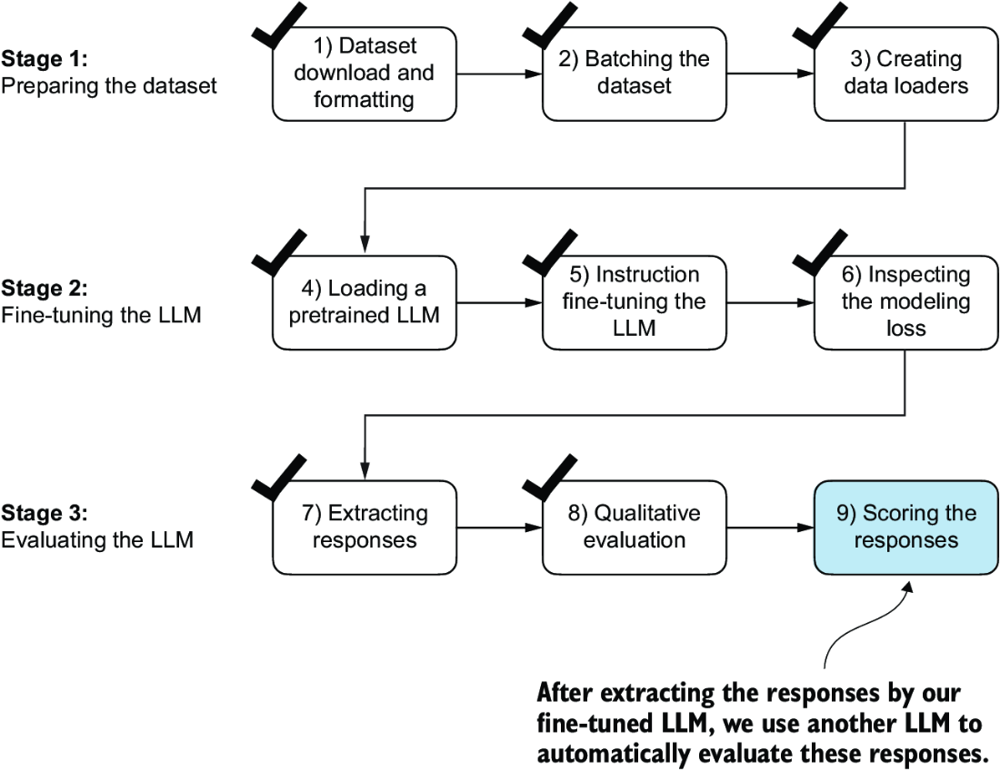


**Figure 7.19 The three-stage process for instruction fine-tuning the LLM.**

**In this last step of the instruction-fine-tuning pipeline, we implement a**

**method to quantify the performance of the fine-tuned model by scoring**

**the responses it generated for the test.**

To evaluate test set responses in an automated fashion, we
utilize an existing instruction-fine-tuned 8-billion-parameter
Llama 3 model developed by Meta AI. This model can be run
locally using the open source Ollama application
(https://ollama.com).

NOTE  Ollama is an efficient application for running
LLMs on a laptop. It serves as a wrapper around the
open source llama.cpp library
(https://github.com/ggerganov/llama.cpp), which
implements LLMs in pure C/C++ to maximize efficiency.
However, Ollama is only a tool for generating text using
LLMs (inference) and does not support training or fine-
tuning LLMs.

**USING LARGER LLMS VIA WEB APIS**

The 8-billion-parameter Llama 3 model is a very capable
LLM that runs locally. However, it’s not as capable as large
proprietary LLMs such as GPT-4 offered by OpenAI. For
readers interested in exploring how to utilize GPT-4
through the OpenAI API to assess generated model
responses, an optional code notebook is available within
the supplementary materials accompanying this book at
https://mng.bz/BgEv.

To execute the following code, install Ollama by visiting
https://ollama.comand follow the provided instructions for
your operating system:

For macOS and Windows users—Open the downloaded Ollama
application. If prompted to install command-line usage, select Yes.
For Linux users—Use the installation command available on the
Ollama website.

Before implementing the model evaluation code, let’s first
download the Llama 3 model and verify that Ollama is
functioning correctly by using it from the command-line
terminal. To use Ollama from the command line, you must
either start the Ollama application or run   in a
`ollamaserve`
separate terminal, as shown in figure 7.20.

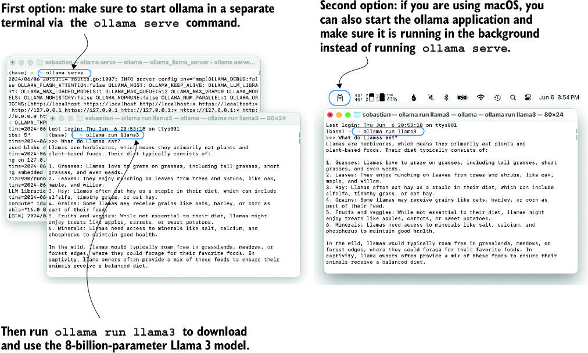

**Figure 7.20 Two options for running Ollama. The left panel illustrates**

**starting Ollama using**`ollama` `serve`**. The right panel shows a second option**

**in macOS, running the Ollama application in the background instead of**

**using the**`ollama` `serve`**command to start the application.**
With the Ollama application or   running in a
`ollamaserve`
different terminal, execute the following command on the
command line (not in a Python session) to try out the 8-
billion-parameter Llama 3 model:
```python
ollama run llama3
```


The first time you execute this command, this model, which
takes up 4.7 GB of storage space, will be automatically
downloaded. The output looks like the following:
```python
pulling manifest
pulling 6a0746a1ec1a... 100% |████████████████| 4.7 GB
pulling 4fa551d4f938... 100% |████████████████|  12 KB
pulling 8ab4849b038c... 100% |████████████████|  254 B
pulling 577073ffcc6c... 100% |████████████████|  110 B
pulling 3f8eb4da87fa... 100% |████████████████|  485 B
verifying sha256 digest
writing manifest
removing any unused layers
success
```

**ALTERNATIVE OLLAMA MODELS**

The `llama3` in the `ollama` `run` `llama3` command refers to the
instruction-fine-tuned 8-billion-parameter Llama 3 model.
Using Ollama with the  model requires approximately
`llama3`
16 GB of RAM. If your machine does not have sufficient
RAM, you can try using a smaller model, such as the 3.8-
billion-parameter  model via   , which
`phi3ollamarunllama3`
only requires around 8 GB of RAM.

For more powerful computers, you can also use the larger
70-billion-parameter Llama 3 model by replacing `llama3`
with . However, this model requires significantly
`llama3:70b`
more computational resources.

Once the model download is complete, we are presented
with a command-line interface that allows us to interact with
the model. For example, try asking the model, “What do
llamas eat?”
```python
>>> What do llamas eat?
Llamas are ruminant animals, which means they have a four-chambered
stomach and eat plants that are high in fiber. In the wild,
llamas typically feed on:
1. Grasses: They love to graze on various types of grasses, including tall
grasses, wheat, oats, and barley.
```


Note that the response you see might differ since Ollama is
not deterministic as of this writing.

You can end this `ollama` `run` `llama3` session using the input
`/bye`. However, make sure to keep the `ollama` `serve` command
or the Ollama application running for the remainder of this
chapter.

The following code verifies that the Ollama session is
running properly before we use Ollama to evaluate the test
set responses:
```python
import psutil
def check_if_running(process_name):
running = False
for proc in psutil.process_iter(["name"]):
if process_name in proc.info["name"]:
running = True
break
return running
ollama_running = check_if_running("ollama")
if not ollama_running:
raise RuntimeError(
"Ollama not running. Launch ollama before proceeding."
)
print("Ollama running:", check_if_running("ollama"))
```

Ensure that the output from executing the previous code
displays `Ollama` `running:` `True`. If it shows `False`, verify that the
`ollama` `serve` command or the Ollama application is actively
running.

**RUNNING THE CODE IN A NEW PYTHON SESSION**

If you already closed your Python session or if you prefer
to execute the remaining code in a different Python
session, use the following code, which loads the instruction
and response data file we previously created and redefines
the  function we used earlier (the  progress
`format_inputtqdm`
bar utility is used later):
```python
import json
from tqdm import tqdm
file_path = "instruction-data-with-response.json"
with open(file_path, "r") as file:
test_data = json.load(file)
def format_input(entry):
instruction_text = (
f"Below is an instruction that describes a task. "
f"Write a response that appropriately completes the request."
f"\n\\n### Instruction:\\n{entry['instruction']}"
)
input_text = (
f"\n\\n### Input:\\n{entry['input']}" if entry["input"] else ""
)
return instruction_text + input_text
```

An alternative to the   command for interacting with
`ollamarun`
the model is through its REST API using Python. The
`query_model` function shown in the following listing
demonstrates how to use the API.

**Listing 7.10 Querying a local Ollama model**

```python
import urllib.request
def query_model(
prompt,
model="llama3",
url="http://localhost:11434/api/chat"
):
data = {             #1
"model": model,
"messages": [
{"role": "user", "content": prompt}
],
"options": {         #2
"seed": 123,
"temperature": 0,
"num_ctx": 2048
}
}
payload = json.dumps(data).encode("utf-8")    #3
request = urllib.request.Request(                       #4
url,                                                #4
data=payload,                                       #4
method="POST"                                       #4
) #4
request.add_header("Content-Type", "application/json")   #4
response_data = ""
with urllib.request.urlopen(request) as response:   #5
while True:
line = response.readline().decode("utf-8")
if not line:
break
response_json = json.loads(line)
response_data += response_json["message"]["content"]
return response_data
```

**#1 Creates the data payload as a dictionary**

**#2 Settings for deterministic responses**

**#3 Converts the dictionary to a JSON-formatted string and encodes it to**

**bytes**

**#4 Creates a request object, setting the method to POST and adding**

**necessary headers**

**#5 Sends the request and captures the response**

Before running the subsequent code cells in this notebook,
ensure that Ollama is still running. The previous code cells
should print `"Ollama` `running:` `True"` to confirm that the model
is active and ready to receive requests.

The following is an example of how to use the
`query_model`
function we just implemented:
```python
model = "llama3"
result = query_model("What do Llamas eat?", model)
print(result)
```

The resulting response is as follows:
```python
Llamas are ruminant animals, which means they have a four-chambered
stomach that allows them to digest plant-based foods. Their diet
typically consists of:
1. Grasses: Llamas love to graze on grasses, including tall grasses,
short grasses, and even weeds.
...
```

Using the  function defined earlier, we can
`query_model`
evaluate the responses generated by our fine-tuned model
that prompts the Llama 3 model to rate our fine-tuned
model’s responses on a scale from 0 to 100 based on the
given test set response as reference.

First, we apply this approach to the first three examples
from the test set that we previously examined:
```python
for entry in test_data[:3]:
prompt = (
f"Given the input `{format_input(entry)}` "
f"and correct output `{entry['output']}`, "
f"score the model response `{entry['model_response']}`"
f" on a scale from 0 to 100, where 100 is the best score. "
)
print("\nDataset response:")
print(">>", entry['output'])
print("\nModel response:")
print(">>", entry["model_response"])
print("\nScore:")
print(">>", query_model(prompt))
print("\n-------------------------")
```

This code prints outputs similar to the following (as of this
writing, Ollama is not fully deterministic, so the generated
texts may vary):

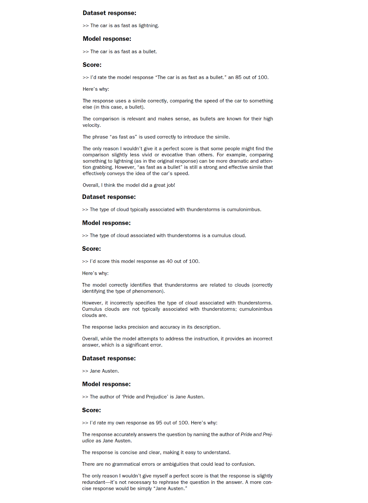


The generated responses show that the Llama 3 model
provides reasonable evaluations and is capable of assigning
partial points when a model’s answer is not entirely correct.
For instance, if we consider the evaluation of the “cumulus
cloud” answer, the model acknowledges the partial
correctness of the response.

The previous prompt returns highly detailed evaluations in
addition to the score. We can modify the prompt to just
generate integer scores ranging from 0 to 100, where 100
represents the best possible score. This modification allows
us to calculate an average score for our model, which serves
as a more concise and quantitative assessment of its
performance. The `generate_model_scores` function shown in the
following listing uses a modified prompt telling the model to
`"Respondwiththeintegernumberonly."`

**Listing 7.11 Evaluating the instruction fine-tuning LLM**

```python
def generate_model_scores(json_data, json_key, model="llama3"):
scores = []
for entry in tqdm(json_data, desc="Scoring entries"):
prompt = (
f"Given the input `{format_input(entry)}` "
f"and correct output `{entry['output']}`, "
f"score the model response `{entry[json_key]}`"
f" on a scale from 0 to 100, where 100 is the best score. "
f"Respond with the integer number only."   #1
)
score = query_model(prompt, model)
try:
scores.append(int(score))
except ValueError:
print(f"Could not convert score: {score}")
continue
return scores
```

**#1 Modified instruction line to only return the score**

Let’s now apply the `generate_model_scores` function to the
entire  set, which takes about 1 minute on a M3
`test_data`
Macbook Air:

```python
scores = generate_model_scores(test_data, "model_response")
print(f"Number of scores: {len(scores)} of {len(test_data)}")
print(f"Average score: {sum(scores)/len(scores):.2f}\n")
```

The results are as follows:
```python
Scoring entries: 100%|████████████████████████| 110/110
[01:10<00:00,  1.56it/s]
Number of scores: 110 of 110
Average score: 50.32
```

The evaluation output shows that our fine-tuned model
achieves an average score above 50, which provides a useful
benchmark for comparison against other models or for
experimenting with different training configurations to
improve the model’s performance.

It’s worth noting that Ollama is not entirely deterministic
across operating systems at the time of this writing, which
means that the scores you obtain might vary slightly from
the previous scores. To obtain more robust results, you can
repeat the evaluation multiple times and average the
resulting scores.

To further improve our model’s performance, we can explore
various strategies, such as

Adjusting the hyperparameters during fine-tuning, such as the learning
rate, batch size, or number of epochs
Increasing the size of the training dataset or diversifying the examples
to cover a broader range of topics and styles
Experimenting with different prompts or instruction formats to guide
the model’s responses more effectively
Using a larger pretrained model, which may have greater capacity to
capture complex patterns and generate more accurate responses

NOTE  For reference, when using the methodology
described herein, the Llama 3 8B base model, without
any fine-tuning, achieves an average score of 58.51 on

the test set. The Llama 3 8B instruct model, which has
been fine-tuned on a general instruction-following
dataset, achieves an impressive average score of 82.6.

**EXERCISE 7.4 PARAMETER-EFFICIENT FINE-TUNING WITH LORA**

To instruction fine-tune an LLM more efficiently, modify the
code in this chapter to use the low-rank adaptation
method (LoRA) from appendix E. Compare the training run
time and model performance before and after the
modification.

## 7.9 Conclusions

This chapter marks the conclusion of our journey through
the LLM development cycle. We have covered all the
essential steps, including implementing an LLM architecture,
pretraining an LLM, and fine-tuning it for specific tasks, as
summarized in figure 7.21. Let’s discuss some ideas for what
to look into next.

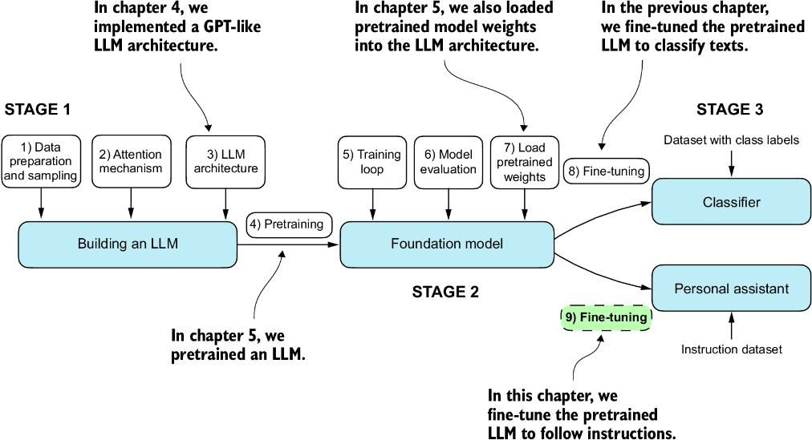

**Figure 7.21 The three main stages of coding an LLM.**

### 7.9.1 What’s next?

While we covered the most essential steps, there is an
optional step that can be performed after instruction fine-
tuning: preference fine-tuning. Preference fine-tuning is
particularly useful for customizing a model to better align
with specific user preferences. If you are interested in
exploring this further, see the
`04_preference-tuning-with-dpo`
folder in this book’s supplementary GitHub repository at
https://mng.bz/dZwD.

In addition to the main content covered in this book, the
GitHub repository also contains a large selection of bonus
material that you may find valuable. To learn more about
these additional resources, visit the Bonus Material section
on the repository’s README page: https://mng.bz/r12g.

### 7.9.2 Staying up to date in a fast-moving field

The fields of AI and LLM research are evolving at a rapid
(and, depending on who you ask, exciting) pace. One way to
keep up with the latest advancements is to explore recent
research papers on arXiv at
https://arxiv.org/list/cs.LG/recent. Additionally, many
researchers and practitioners are very active in sharing and
discussing the latest developments on social media
platforms like X (formerly Twitter) and Reddit. The subreddit
r/LocalLLaMA, in particular, is a good resource for connecting
with the community and staying informed about the latest
tools and trends. I also regularly share insights and write
about the latest in LLM research on my blog, available at
https://magazine.sebastianraschka.com and
https://sebastianraschka.com/blog/.

### 7.9.3 Final words

I hope you have enjoyed this journey of implementing an
LLM from the ground up and coding the pretraining and fine-
tuning functions from scratch. In my opinion, building an
LLM from scratch is the most effective way to gain a deep
understanding of how LLMs work. I hope that this hands-on
approach has provided you with valuable insights and a solid
foundation in LLM development.

While the primary purpose of this book is educational, you
may be interested in utilizing different and more powerful
LLMs for real-world applications. For this, I recommend

exploring popular tools such as Axolotl
(https://github.com/OpenAccess-AI-Collective/axolotl) or
LitGPT (https://github.com/Lightning-AI/litgpt), which I am
actively involved in developing.

Thank you for joining me on this learning journey, and I wish
you all the best in your future endeavors in the exciting field
of LLMs and AI!

## Summary

The instruction-fine-tuning process adapts a pretrained LLM to follow
human instructions and generate desired responses.
Preparing the dataset involves downloading an instruction-response
dataset, formatting the entries, and splitting it into train, validation, and
test sets.
Training batches are constructed using a custom collate function that
pads sequences, creates target token IDs, and masks padding tokens.
We load a pretrained GPT-2 medium model with 355 million
parameters to serve as the starting point for instruction fine-tuning.
The pretrained model is fine-tuned on the instruction dataset using a
training loop similar to pretraining.
Evaluation involves extracting model responses on a test set and
scoring them (for example, using another LLM).
The Ollama application with an 8-billion-parameter Llama model can
be used to automatically score the fine-tuned model’s responses on the
test set, providing an average score to quantify performance.
